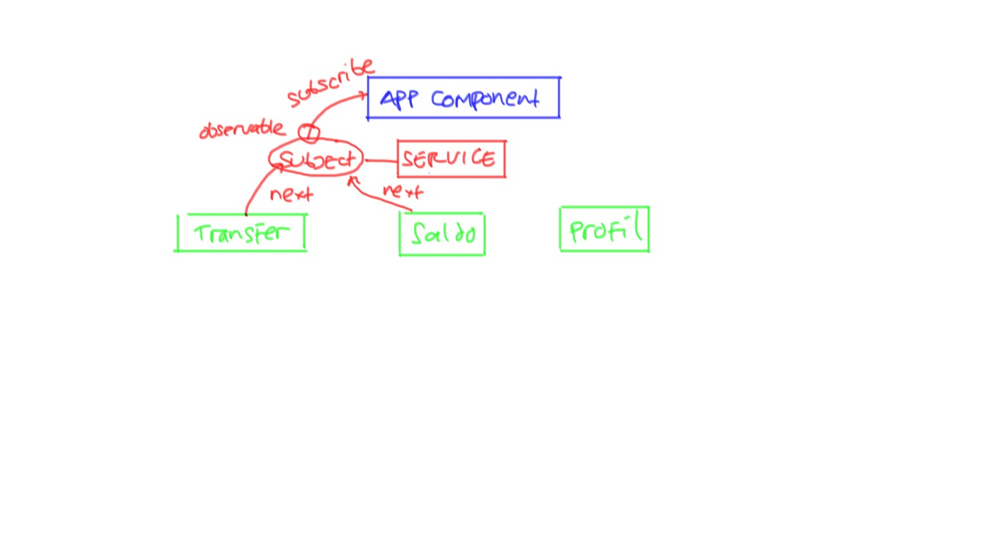

# Training Angular 2 #

Materi:

* Setup Project
* Menu dan Navigasi
* Menampilkan data di tabel
* Input data dengan form
* HTTP Request/Response
* Upload File
* Authentication

## Studi Kasus ##

Aplikasi Internet Banking.

Fitur :

* Login/Logout


* Info Saldo


* Daftar Rekening


* Detail Rekening


* Mutasi Rekening


* Transfer


* Update Profile


## Rancangan Aplikasi ##

Daftar Modul dan Komponen

* Modul Otentikasi

    * Komponen CurrentUser
    * Service Authentication

* Komponen Navigasi

* Modul Rekening

    * Service Rekening
    * Komponen Daftar Rekening
    * Komponen Detail Rekening

* Modul Mutasi

    * Service Mutasi
    * Komponen Form Pencarian
    * Komponen Daftar Mutasi
    * Komponen Detail Mutasi

* Modul Transfer

    * Service Transfer
    * Komponen Form Transfer
    * Komponen Konfirmasi Transfer

* Modul Profil

    * Service Profil
    * Komponen Form Profil
    * Komponen Tampilkan Profil

## Arsitektur Aplikasi Angular 2 ##


* [Cara membuat modul](catatan/membuat-modul.md)

## HTTP Request ke Backend ##

Pada waktu melakukan HTTP Request ke backend yang berbeda host/port, harus memperhatikan [masalah CORS](https://en.wikipedia.org/wiki/Cross-origin_resource_sharing).

Supaya kita tidak terkena masalah CORS, sebaiknya menggunakan proxy seperti ini


Demikian juga waktu deploy ke production, sebaiknya menggunakan reverse proxy atau load balancer seperti ini


Konfigurasi proxy di `angular-cli` dilakukan dengan membuat file `proxy.conf.json` di root folder project. Isinya sebagai berikut

```json
{
  "/api": {
    "target": "http://localhost:8080",
    "pathRewrite": {"^/api" : ""},
    "secure": false
  }
}
```
File ini digunakan pada waktu menjalankan `ng-serve` sebagai berikut

```
ng serve --proxy-config proxy.conf.json
```

Outputnya seperti ini

```
** NG Live Development Server is running on http://localhost:4200. **
 10% building modules 2/2 modules 0 active[HPM] Proxy created: /api  ->  http://localhost:8080
[HPM] Proxy rewrite rule created: "^/api" ~> ""
```

## Komunikasi Antar Komponen ##

Komponen satu mengirim data ke komponen lain melalui berbagai cara, antara lain:

* Menggunakan `@Input` dan `@Output`
* Menggunakan `Observable`

### Komunikasi dengan Observable ###

Mekanisme :

* buat service yang berisi `Subject`. Ini adalah class yang disediakan `RxJs`.
* Komponen B subscribe ke `Observable` yang diambil dari `Subject`
* Komponen A mengirim data ke `Subject` dengan method `next`
* Komponen B menerima data dari `Observable`, karena dia sudah subscribe

Gambarnya seperti ini



Contoh service berisi subject

```ts
@Injectable()
export class ProgressIndicatorService {

  private status = new Subject<any>();

  getStatus() : Observable<any> {
    return this.status.asObservable();
  }

  toggleIndicator(data : any){
    this.status.next(data);
  }

  constructor() { }

}
```

Contoh komponen yang mengirim data

```ts
export class MutasiRekeningComponent implements OnInit {

  constructor(private progress : ProgressIndicatorService) { }

  showNotification(){
      this.progress.toggleIndicator("Halo");
      setTimeout(() => this.progress.toggleIndicator(null), 3000);
  }

  hideNotification(){
      this.progress.toggleIndicator(null);
  }
}
```

Contoh komponen yang menerima data

```ts
export class AppComponent implements OnInit, OnDestroy {
  notification : string;
  subscription: Subscription;
  @ViewChild("staticModal") staticModal;

  constructor(private progress : ProgressIndicatorService ) { }

  ngOnInit(){
    this.subscription = this.progress.getStatus().subscribe(data => {
        this.notification = data;
        if(data) {
            this.staticModal.show();
        } else {
            this.staticModal.hide();
        }
    });
  }

  ngOnDestroy(){
    this.subscription.unsubscribe();
  }
}
```
