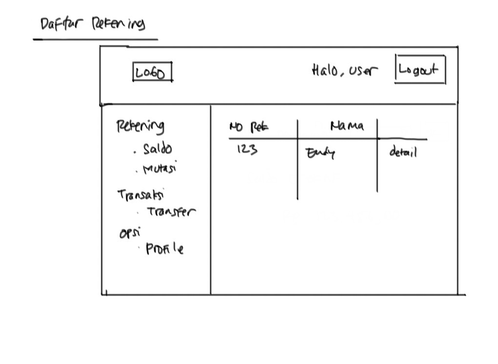
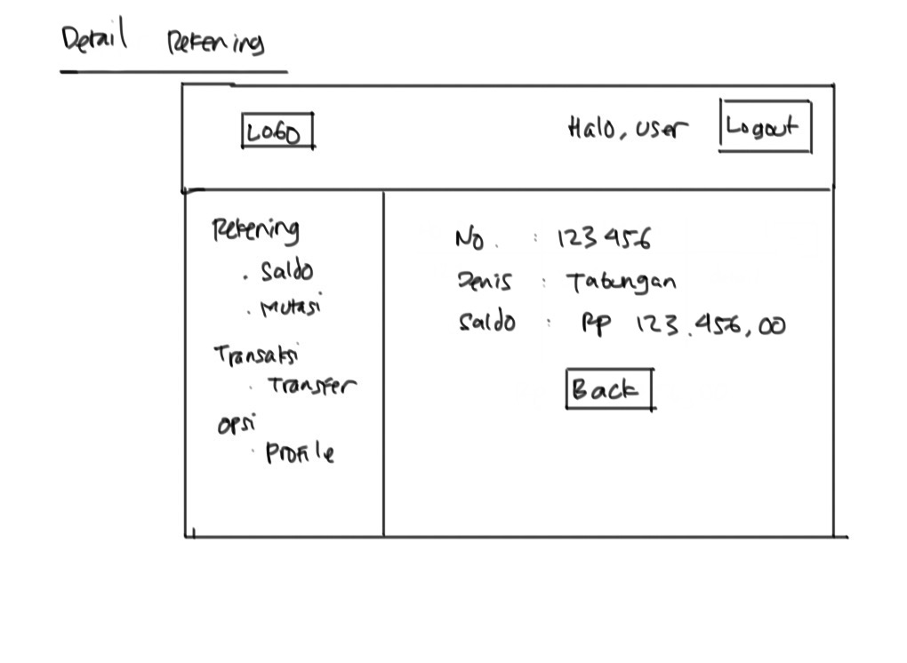
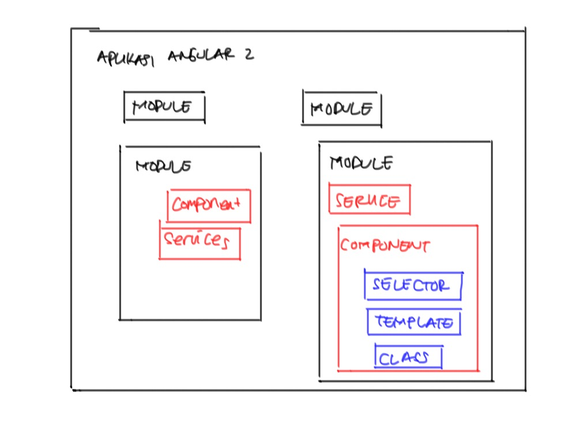
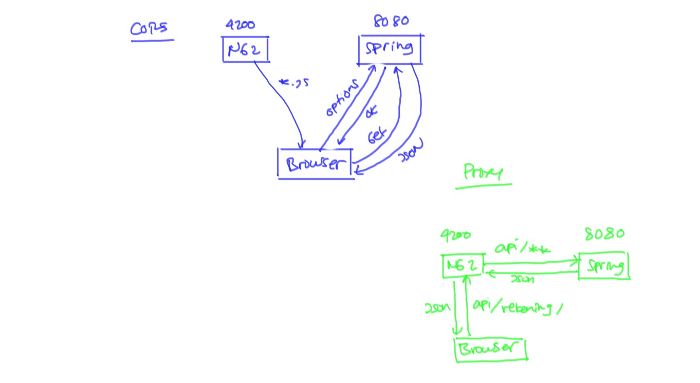
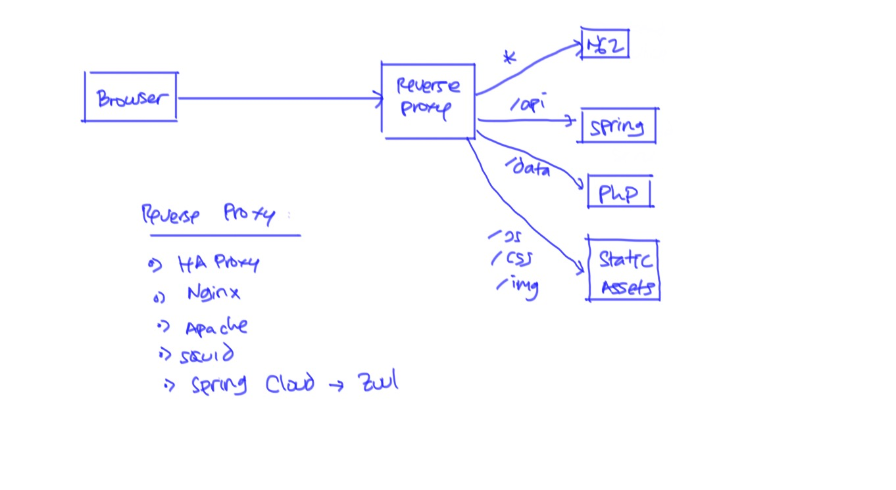

# Training Angular 2 #

Materi:

* Setup Project
* Menu dan Navigasi
* Menampilkan data di tabel
* Input data dengan form
* HTTP Request/Response
* Upload File
* Authentication

## Studi Kasus ##

Aplikasi Internet Banking.

Fitur :

* Login/Logout


* Info Saldo


* Daftar Rekening



* Detail Rekening



* Mutasi Rekening


* Transfer


* Update Profile


## Rancangan Aplikasi ##

Daftar Modul dan Komponen

* Modul Otentikasi

    * Komponen CurrentUser
    * Service Authentication

* Komponen Navigasi

* Modul Rekening

    * Service Rekening
    * Komponen Daftar Rekening
    * Komponen Detail Rekening

* Modul Mutasi

    * Service Mutasi
    * Komponen Form Pencarian
    * Komponen Daftar Mutasi
    * Komponen Detail Mutasi

* Modul Transfer

    * Service Transfer
    * Komponen Form Transfer
    * Komponen Konfirmasi Transfer

* Modul Profil

    * Service Profil
    * Komponen Form Profil
    * Komponen Tampilkan Profil

## Arsitektur Aplikasi Angular 2 ##



* [Cara membuat modul](catatan/membuat-modul.md)

## HTTP Request ke Backend ##

Pada waktu melakukan HTTP Request ke backend yang berbeda host/port, harus memperhatikan [masalah CORS](https://en.wikipedia.org/wiki/Cross-origin_resource_sharing).

Supaya kita tidak terkena masalah CORS, sebaiknya menggunakan proxy seperti ini



Demikian juga waktu deploy ke production, sebaiknya menggunakan reverse proxy atau load balancer seperti ini



Konfigurasi proxy di `angular-cli` dilakukan dengan membuat file `proxy.conf.json` di root folder project. Isinya sebagai berikut

```json
{
  "/api": {
    "target": "http://localhost:8080",
    "pathRewrite": {"^/api" : ""},
    "secure": false
  }
}
```
File ini digunakan pada waktu menjalankan `ng-serve` sebagai berikut

```
ng serve --proxy-config proxy.conf.json
```

Outputnya seperti ini

```
** NG Live Development Server is running on http://localhost:4200. **
 10% building modules 2/2 modules 0 active[HPM] Proxy created: /api  ->  http://localhost:8080
[HPM] Proxy rewrite rule created: "^/api" ~> ""
```
