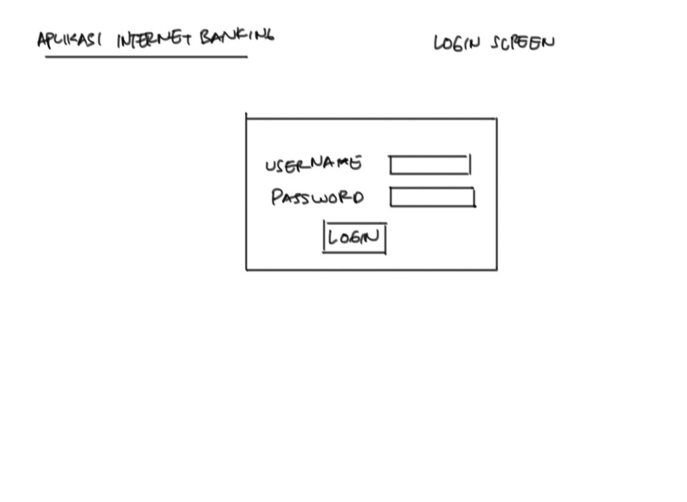
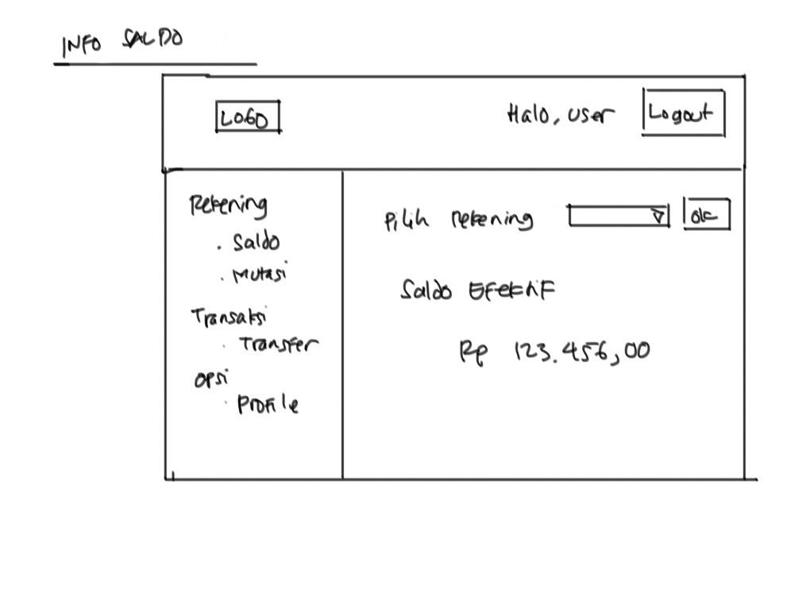
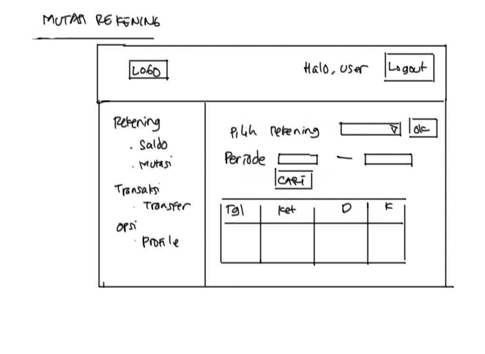
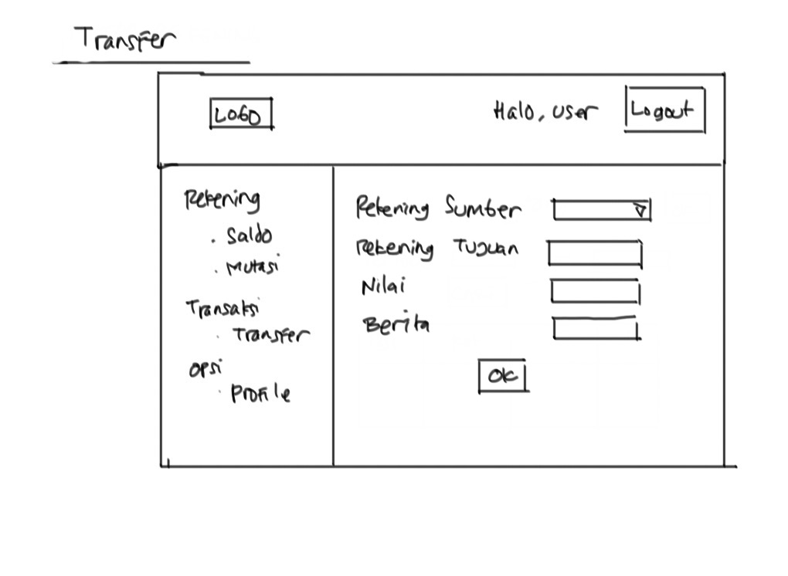
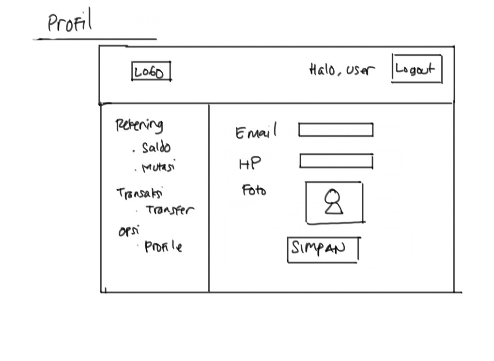

# Training Angular 2 #

Materi:

* Setup Project
* Menu dan Navigasi
* Menampilkan data di tabel
* Input data dengan form
* HTTP Request/Response
* Upload File
* Authentication

## Studi Kasus ##

Aplikasi Internet Banking.

Fitur :

* Login/Logout

* Info Saldo

* Mutasi Rekening

* Transfer

* Update Profile

